# Fortification - Game Level For Tremulous
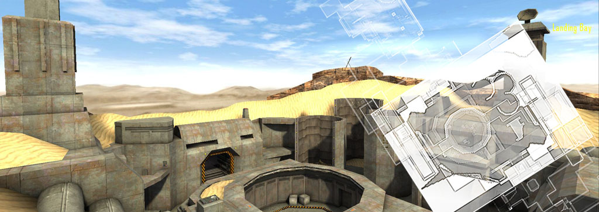 

## Overview: Sci-Fi Military Base in the Sahara

Fortification is a game level by Matthias "Masmblr" Peters for the open source game [_Tremulous_](https://tremulous.net/).

Map Description:
> Welcome to "Fortification," an abandoned sci-fi military base in the vast expanse of the Sahara desert. Drawing inspiration from the layout of the popular map "fort5".
> 
> The design of Fortification embraces the eerie and desolate ambiance of a once-thriving military facility, now left to the unforgiving desert sands. Players will find themselves navigating through a axially symmetrical environment. At the core of Fortification lies a central battleground and shuttle landing area. This open, mid-sized arena serves as the focal point of the map, where players will engage in fierce firefights and tactical skirmishes.
> 
> One of the key highlights of Fortification is the dual-access system. Players can choose between two distinct paths to approach the central battleground.
Delving deeper into the mysteries of the abandoned military base, players will discover an underground connection tunnel.
 
* * *

## Screenshots:
[[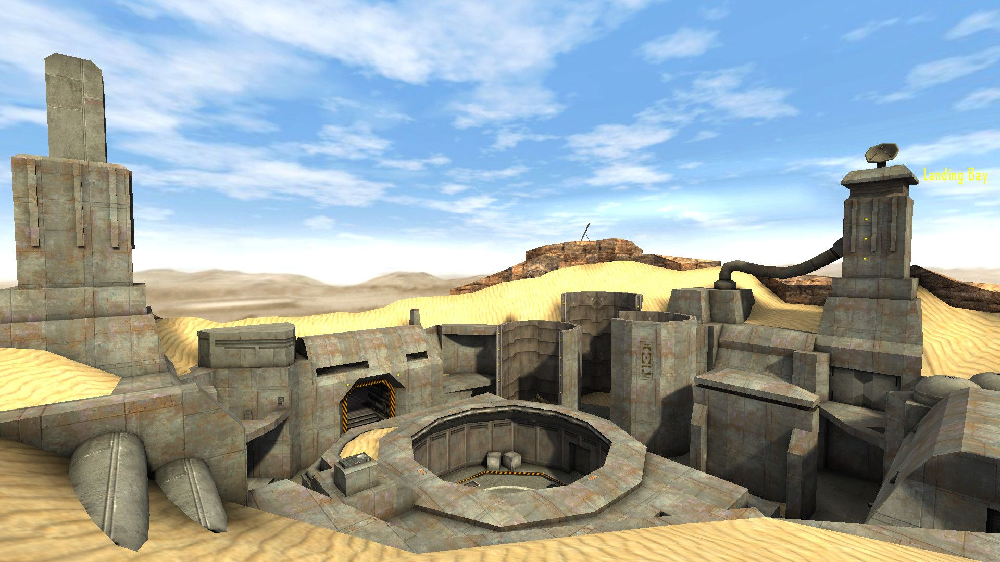](meta/preview_levelshots/1.jpg)
[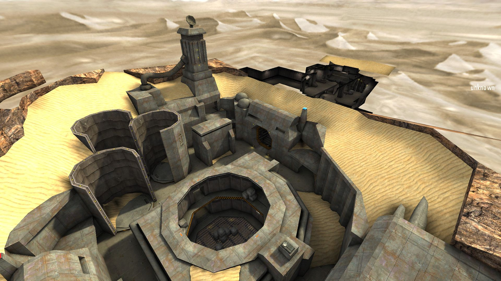](meta/preview_levelshots/2.jpg)
[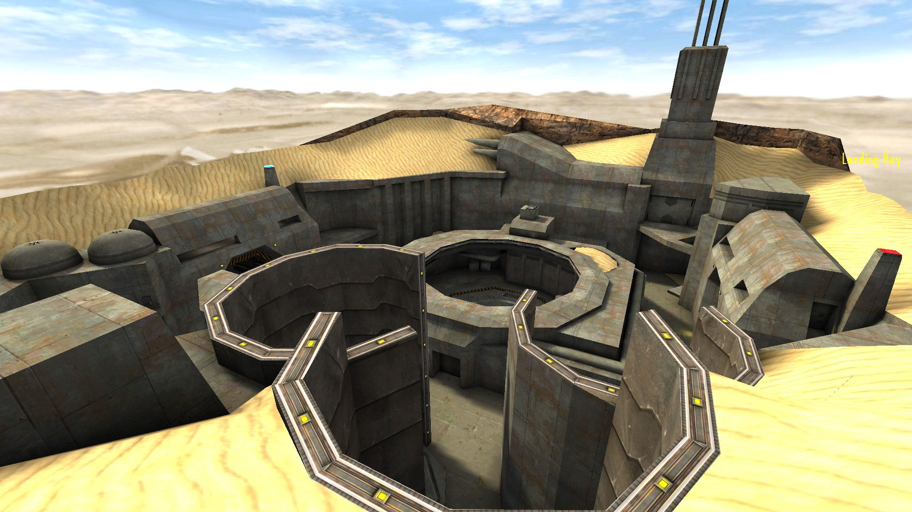](meta/preview_levelshots/3.jpg)
[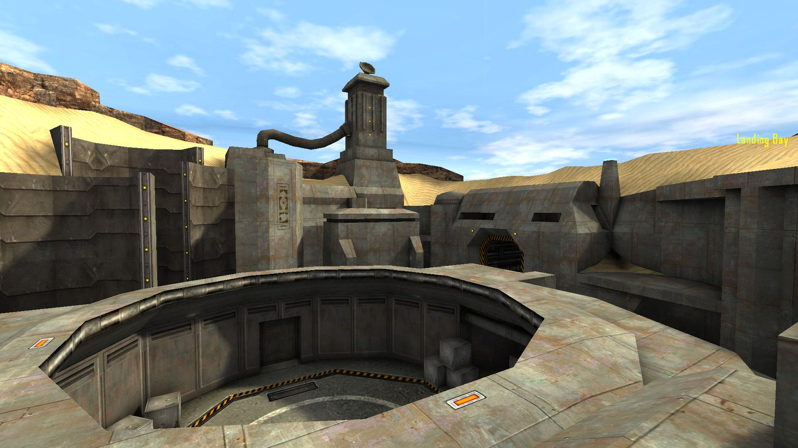](meta/preview_levelshots/4.jpg)
[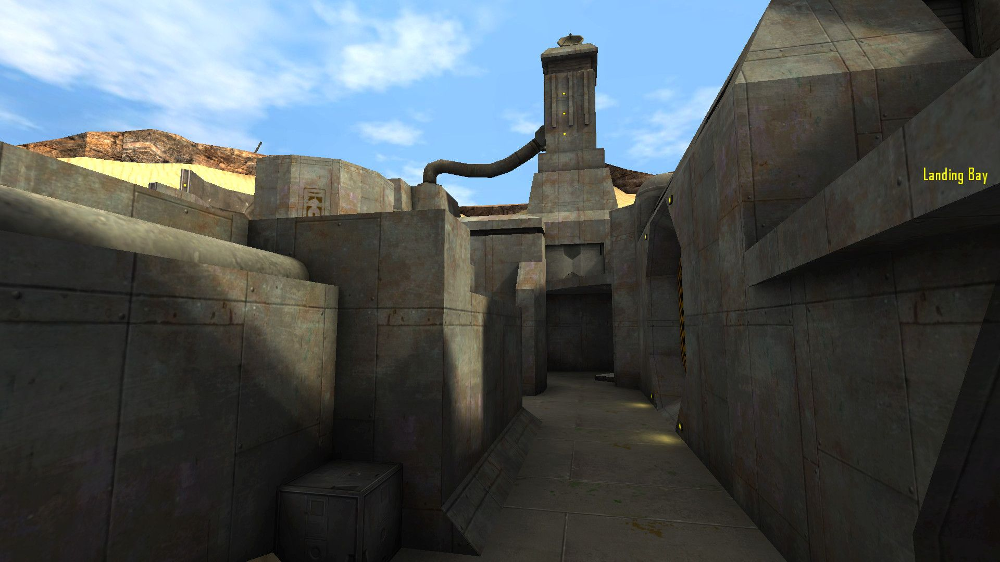](meta/preview_levelshots/5.jpg)
[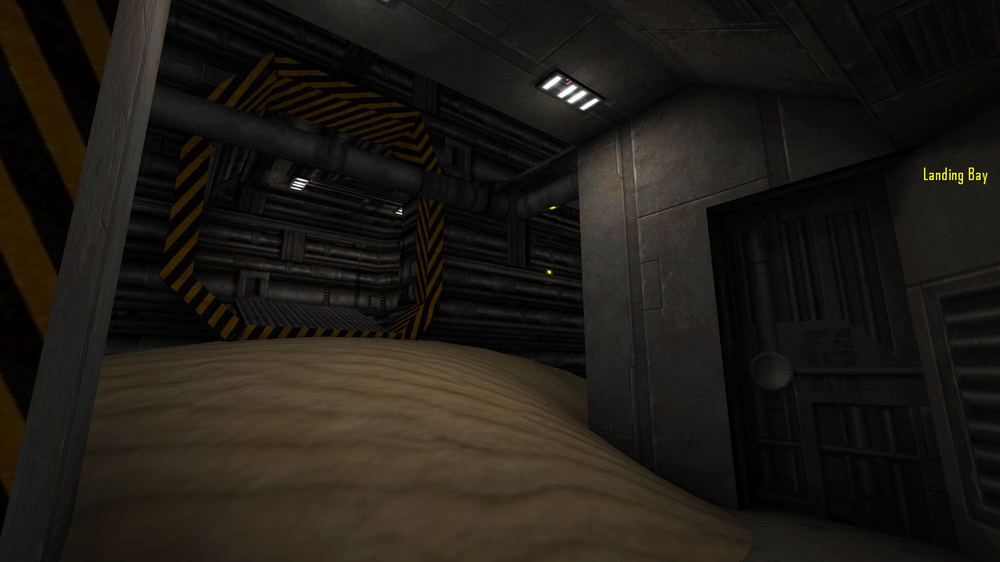](meta/preview_levelshots/6.jpg)
[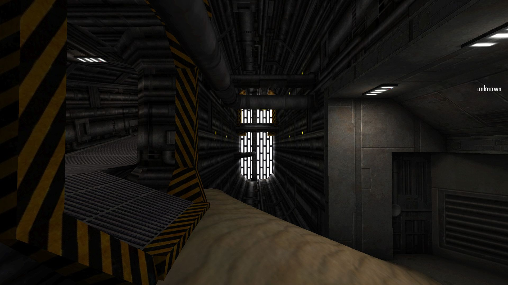](meta/preview_levelshots/7.jpg)
[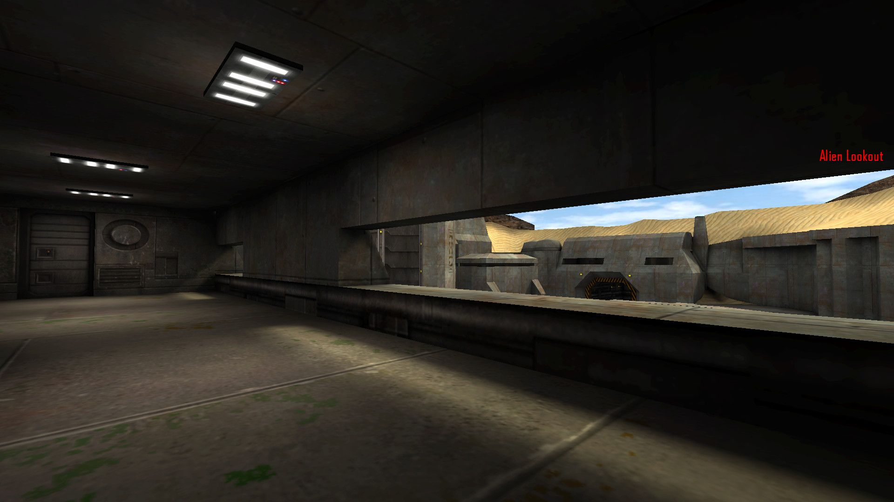](meta/preview_levelshots/8.jpg)
[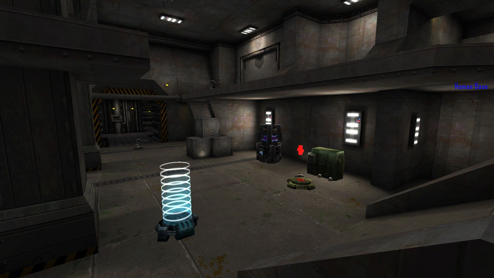](meta/preview_levelshots/9.jpg)
[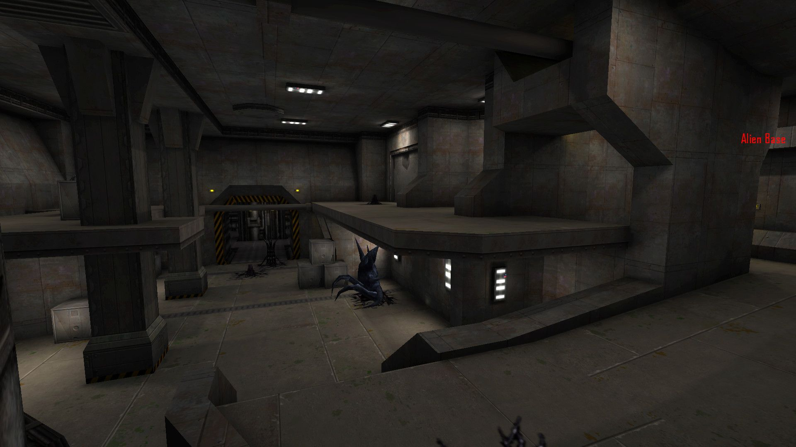](meta/preview_levelshots/10.jpg)
[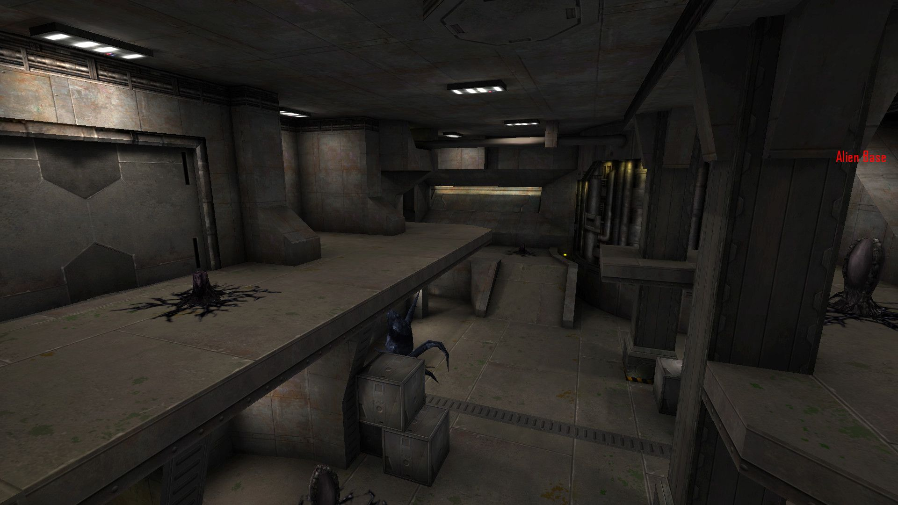](meta/preview_levelshots/11.jpg)
[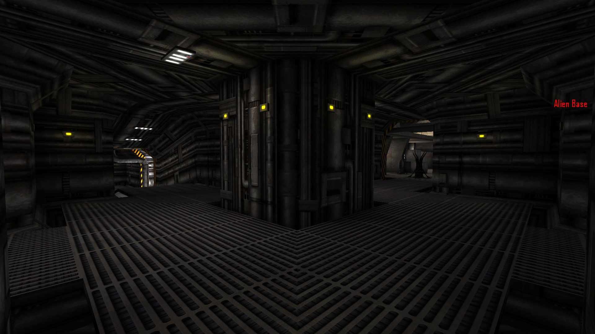](meta/preview_levelshots/12.jpg)
[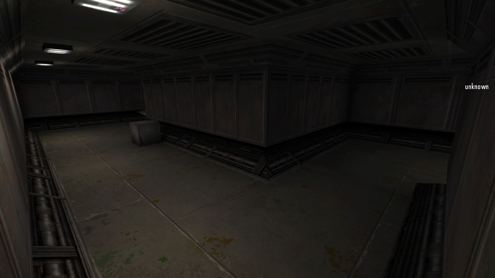](meta/preview_levelshots/13.jpg)

## Version History:
| Version: | Date:        | Status: | Release Build (.pk3):       
| ------- | ------------- | ------: | -----------------: |
| 1.0     | 20/09/2016  | beta | :x:        |     
| 1.1     | 26/09/2016  | beta | :x:        |     
| 1.2     | 29/09/2016  | final | [💾](https://github.com/Masmblr/map-Fortification_src/releases/) |

## How-To
**Binary**:
1. Download the release package.
2. Save the *.pk3 file to the following directory: `/%PATH%/Tremulous/base/`.
3. Start the Tremulous game and select "Create Server" with the desired map.

**Source**:
1. Download the [source release](https://github.com/Masmblr/map-Fortification_src/releases/) and the [tremulous-common-files](https://github.com/Masmblr/tremulous-map-common/releases/tag/v1.0).
2. Extract the files to the default installation directory. It should look like this:

```
DRIVE:/%PATH%/tremulous/
|   tremulous.exe
|   tremulous.x86
|   ...
+---base
|   |   autogen.cfg
|   |   data-1.1.0.pk3
|   |   map-atcs-1.1.0.pk3
|   |   ...
|   +---env
|   +---maps 
|   +---models 
|   +---scripts
|   +---sounds
|   \---textures
```
1. Download [NetRadiant Level Editor](https://netradiant.gitlab.io/page/download/).
2. Launch NetRadiant and select "Tremulous" as your game setting.
3. Open the '.map' file located in the directory `/%PATH%/tremulous/base/maps` and, from the menu, choose 'Build -> 'Build with final settings.'
4. Start the Tremulous game with `-sv_pure 0 -devmap MAPNAME`. Make sure to replace "MAPNAME" with the actual name of the map you compiled.

## Development Tools:
Photoshop CS6 \
[Audacity](https://www.audacityteam.org/) \
[NetRadiant](https://netradiant.gitlab.io/) \
[Q3Map2](http://q3map2.robotrenegade.com/)

## Related Resources:
Official Tremulous website: https://tremulous.net </br>
NET Radiant Level-Editor: https://netradiant.gitlab.io </br>
Master-Server-List: http://dpmaster.deathmask.net/?game=tremulous </br>
Unofficial successor "Unvanquished": https://unvanquished.net

## Legal Information and Attribution
Some assets may be derivative works or subject to different licenses. Please refer for author and license details. Note that some files may have been modified. Below is a list of files and their legal statuses.

***
levelshots\fortification.jpg <sup>[1](#Credit-1)</sup> \
maps\fortification.map <sup>[1](#Credit-1)</sup> \
scripts\fortification.arena <sup>[1](#Credit-1)</sup> \
scripts\fortification.shader <sup>[1](#Credit-1)</sup> \
scripts\shaderlist.txt <sup>[1](#Credit-1)</sup> \
textures\fortification\crate_01.jpg <sup>[2](#Credit-2)</sup> \
textures\fortification\crate_02.jpg <sup>[2](#Credit-2)</sup> \
textures\fortification\decal_01.jpg <sup>[2](#Credit-2)</sup> \
textures\fortification\door_01.jpg <sup>[2](#Credit-2)</sup> \
textures\fortification\door_02.jpg <sup>[2](#Credit-2)</sup> \
textures\fortification\floor_01.jpg <sup>[2](#Credit-2)</sup> \
textures\fortification\floor_02.jpg <sup>[2](#Credit-2)</sup> \
textures\fortification\floor_03.jpg <sup>[2](#Credit-2)</sup> \
textures\fortification\floor_04.jpg <sup>[2](#Credit-2)</sup> \
textures\fortification\floor_05.jpg <sup>[1](#Credit-1)</sup> \
textures\fortification\floor_06.jpg <sup>[2](#Credit-2)</sup> \
textures\fortification\floor_07.jpg <sup>[2](#Credit-2)</sup> \
textures\fortification\floor_08.tga <sup>[2](#Credit-2)</sup> \
textures\fortification\func_01.jpg <sup>[2](#Credit-2)</sup> \
textures\fortification\glass_01.jpg <sup>[2](#Credit-2)</sup> \
textures\fortification\light_01.jpg <sup>[2](#Credit-2)</sup> \
textures\fortification\light_01_glow.jpg <sup>[2](#Credit-2)</sup> \
textures\fortification\light_02.jpg <sup>[2](#Credit-2)</sup> \
textures\fortification\light_02_glow.jpg <sup>[2](#Credit-2)</sup> \
textures\fortification\light_03.jpg <sup>[2](#Credit-2)</sup> \
textures\fortification\light_03_glow.jpg <sup>[2](#Credit-2)</sup> \
textures\fortification\sfx_01.jpg <sup>[2](#Credit-2)</sup> \
textures\fortification\sfx_02.jpg <sup>[2](#Credit-2)</sup> \
textures\fortification\top_01.jpg <sup>[2](#Credit-2)</sup> \
textures\fortification\top_01b.jpg <sup>[2](#Credit-2)</sup> \
textures\fortification\trim_01.jpg <sup>[2](#Credit-2)</sup> \
textures\fortification\trim_02.jpg <sup>[2](#Credit-2)</sup> \
textures\fortification\trim_03.jpg <sup>[2](#Credit-2)</sup> \
textures\fortification\trim_04.jpg <sup>[2](#Credit-2)</sup> \
textures\fortification\wall_01.jpg <sup>[2](#Credit-2)</sup> \
textures\fortification\wall_03.jpg <sup>[2](#Credit-2)</sup> \
textures\fortification\wall_04.jpg <sup>[2](#Credit-2)</sup> \
textures\fortification\wall_05.jpg <sup>[2](#Credit-2)</sup> \
textures\fortification\wall_06.jpg <sup>[2](#Credit-2)</sup> \
textures\fortification\wall_07.jpg <sup>[2](#Credit-2)</sup> \
textures\fortification\wall_08.jpg <sup>[2](#Credit-2)</sup> \
textures\fortification\weather.jpg <sup>[1](#Credit-1)</sup>
***

### Credit-1

[Matthias "Masmblr Peters"](mailto:masmblr@gmail.com) \
Content: Map, Textures, Shaders \
License: [MIT License](https://opensource.org/license/mit/).
(See "LICENSE" file for more Informations.)

### Credit-2
Milosh Andrich \
Content:  Sci fi Texure \
License: Attribution License

For all other content, their respective licensing rules and other legal provisions apply.

## Special Thanks:
* id Software for Quake3
* Dark Legion Development for Tremulous
* Team Xonotic for NetRadiant 
